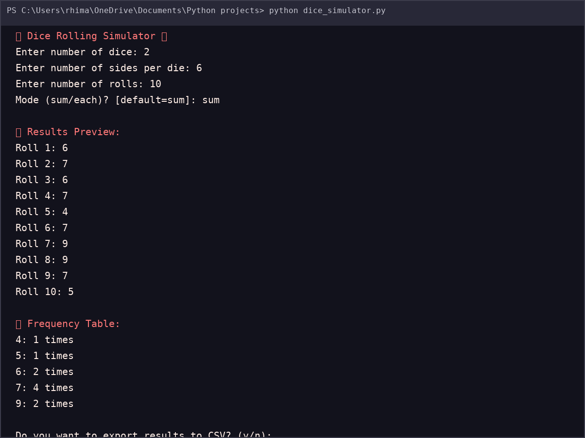
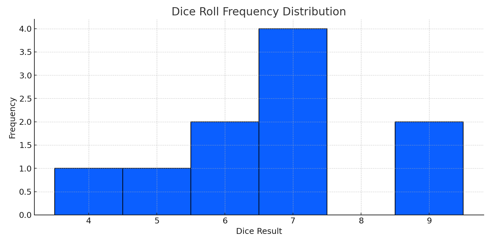
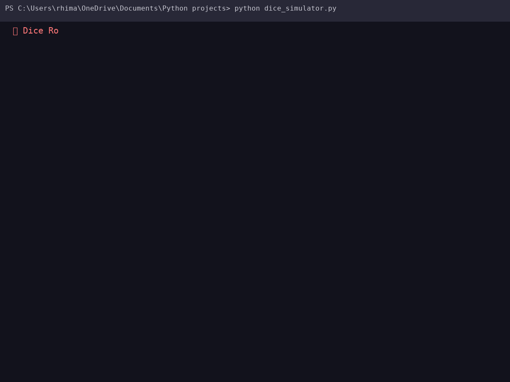

# 🎲 Dice Rolling Simulator

A Python-based Dice Rolling Simulator with:
- Terminal output 📟
- Frequency table 📊
- Histogram visualization 📈
- CSV export option 📂

---

## 🚀 Features
- Roll **any number of dice** with **custom sides**
- Choose **mode**: `sum` of dice or `each` die result
- Get **frequency distribution** of rolls
- Visualize results with a **histogram chart**
- Export results to **CSV file**

---

## 📸 Demo

### Terminal Output


### Histogram Chart


### Live Demo (GIF)


---

## 🛠️ Installation

1. **Clone the repository**
   ```bash
   git clone https://github.com/your-username/dice-rolling-simulator.git
   cd dice-rolling-simulator

2. **Create Virtual Environment (optional but recommended)**
    ```bash
       python -m venv venv
       source venv/bin/activate   # Mac/Linux
       venv\Scripts\activate      # Windows

3. **Install dependencies**
   ```bash
   pip install matplotlib pandas

---

### ▶️ Usage

1. **Run the simulator:**
    ```bash
    python dice_simulator.py
    
2. **You will be asked:**
   ```bash
   Enter number of dice: 2
   Enter number of sides per die: 6
   Enter number of rolls: 10
   Mode (sum/each)? [default=sum]: sum

3. **Then you’ll get:**
   * Results Preview
   * Frequency Table
   * Histogram Visualization
   * Option to export results → CSV

 ---

 ### 📂 Project Structure
   ```bash
    📦 dice-rolling-simulator
    ┣ 📜 dice_simulator.py   # Main script
    ┣ 📜 README.md           # Documentation
    ┣ 📂 assets              # Screenshots + GIFs
    ┃  ┣ 📷 terminal_output.png
    ┃  ┣ 📷 histogram.png
    ┃  ┗ 🎥 demo.gif
    ┗ 📜 dice_results.csv         # Exported results (optional)

   


